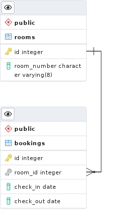

# Backend test task

### Running

* Create `.env` file from `.env.example` (for deployment via `docker-compose` you only need to specify port)
* Run `docker-compose up -d`

OR

* Create database and config your `.env` accordingly
* Execute

```sh
yarn install
yarn build
yarn start:prod
```

### Swagger

Available at `/docs`

### ER Diagram



### Tests

```sh
yarn test
```

Some tests are run only when db config is present.

### E2E Tests

```sh
yarn test:e2e
```
